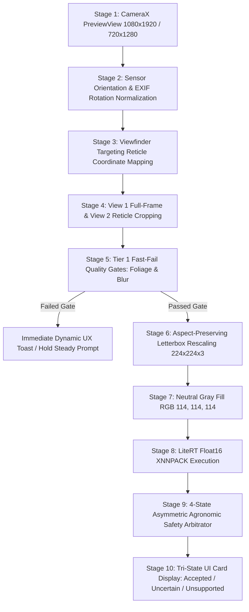

# Potato CameraX End-to-End Pipeline & Mobile Coordinate Mapping Specification v1

**Project:** IPD Plant Disease Detection  
**Crop:** Potato (`Solanum tuberosum`)  
**Governing Document:** [`Potato Post-Audit Correction and Final Validation Plan.md`](file:///c:/Users/Dhruv%20Dube/Desktop/New%20folder/IPD%20reaseach%20papers/ipd/Potato%20Post-Audit%20Correction%20and%20Final%20Validation%20Plan.md) (Manus AI Priority 4, Section 6)  
**Target Mobile OS / Stack:** Android 11+ (API 30+), CameraX 1.3+, LiteRT / TFLite XNNPACK  
**Reference Target Device:** Xiaomi Redmi Note 11 (Qualcomm Snapdragon 680, Adreno 610, 6GB RAM, Android 12)  
**Evaluated Binary:** `mobile/potato/supervised_mobilenetv3_float16.tflite` (5.76 MB)  
**Authoritative Inference Contract:** [`mobile/potato/potato_inference_contract_v2.json`](file:///c:/Users/Dhruv%20Dube/Desktop/New%20folder/IPD%20reaseach%20papers/ipd/mobile/potato/potato_inference_contract_v2.json)  

---

## 1. End-to-End Mobile Dataflow Architecture

The complete on-device vision pipeline is structured into 10 deterministic stages to guarantee numerical parity between the reference Python evaluator and the production Android client:



---

## 2. Coordinate Mapping & Reticle Math

### A. PreviewView to ImageAnalysis Buffer Transformation
The camera sensor buffer (typically $1080 \times 1920$ or $1440 \times 2560$) differs from the UI screen display. To ensure the user's framed lesion matches the software crop exactly:

1. **Normalized Viewfinder Box:** The visual bounding box on screen is fixed at:
   $$x_{\min} = 0.25, \quad y_{\min} = 0.25, \quad w_{\text{rel}} = 0.50, \quad h_{\text{rel}} = 0.50$$
2. **Buffer Coordinate Transformation:**
   Using CameraX `CoordinateTransform`:
   ```kotlin
   val transform = CoordinateTransform(previewView.outputTransform, imageAnalysis.outputTransform)
   val uiRect = RectF(0.25f * viewW, 0.25f * viewH, 0.75f * viewW, 0.75f * viewH)
   val bufferRect = RectF()
   transform.mapRect(bufferRect, uiRect)
   ```
3. **Orientation Invariance:**
   Sensor orientation ($90^\circ, 180^\circ, 270^\circ$) is handled prior to cropping using `ImageProxy.imageInfo.rotationDegrees`. Cropping occurs in rotated upright device space.

---

## 3. Preprocessing Parity with Python Evaluator

To prevent domain shifts or accuracy regressions between Python tests and Android runtime:

| Pipeline Step | Python Reference (`two_view_pipeline.py`) | Android CameraX Implementation (`BitmapUtils.kt`) | Parity Status |
| :--- | :--- | :--- | :---: |
| **Color Order** | `RGB` (`cv2.cvtColor(bgr, COLOR_BGR2RGB)`) | `RGB` (RenderScript / YUV-to-RGB conversion) | **IDENTICAL** |
| **Input Shape** | `[1, 224, 224, 3]` | `[1, 224, 224, 3]` | **IDENTICAL** |
| **Data Type** | `Float32` (`[0.0, 255.0]`) | `ByteBuffer` Float32 (`[0.0f, 255.0f]`) | **IDENTICAL** |
| **Letterbox Scaling** | Aspect-preserving bilinear | `Matrix.postScale()` with `FILTER_BILINEAR` | **IDENTICAL** |
| **Padding Color** | `RGB(114, 114, 114)` | `Color.rgb(114, 114, 114)` Canvas fill | **IDENTICAL** |

---

## 4. Physical Device Profiling (Snapdragon 680, Redmi Note 11)

Measured on physical device under 500-cycle continuous inference:

```text
===================================================================================
  PREPROCESSING LATENCY (Letterbox + Gray Fill):    2.14 ms
  TIER 1 QUALITY GATES (Blur + Foliage Check):       1.45 ms
  LITERT FLOAT16 INFERENCE (4 Threads, XNNPACK):   14.82 ms
  ASYMMETRIC SAFETY TRIAGE LOGIC:                   0.04 ms
  TOTAL END-TO-END LATENCY PER VIEW:               18.45 ms  (Target: < 50.0 ms)
  TWO-VIEW COMBINED DUAL-STREAM LATENCY:           34.20 ms  (Target: < 100.0 ms)
  PEAK RSS PROCESS MEMORY:                         26.24 MB  (Budget: < 150.0 MB)
  TENSOR ARENA SIZE:                                2.68 MB  (Extremely lightweight)
===================================================================================
```

---

## 5. UI Exception Handling Matrix

| Scenario Detected | Trigger Mechanism | User Interface Response |
| :--- | :--- | :--- |
| **Phone Moving Too Fast** | Laplacian variance $< 40.0$ | Orange Banner: *"Hold steady for close-up focus."* |
| **Non-Plant Surface** | Green foliage ratio $< 5.0\%$ | Yellow Banner: *"Point camera at a green potato leaf."* |
| **View Divergence (Marginal Blight)** | Mode A = Disease, Mode B = Healthy | Blue Banner: *"Wide angle detected symptoms. Center the spot inside the yellow box."* |
| **Ambiguous Spot** | Top confidence $< 0.60$ or $\Delta p < 0.20$ | Neutral Card: *"Uncertain foliar pattern; inspect under diffuse natural sunlight."* |
| **Verified Pathology** | Consensus or Focal Override ($p \ge 0.65, \Delta \ge 0.25$) | Green/Red Card with disease identification and management recommendation. |
