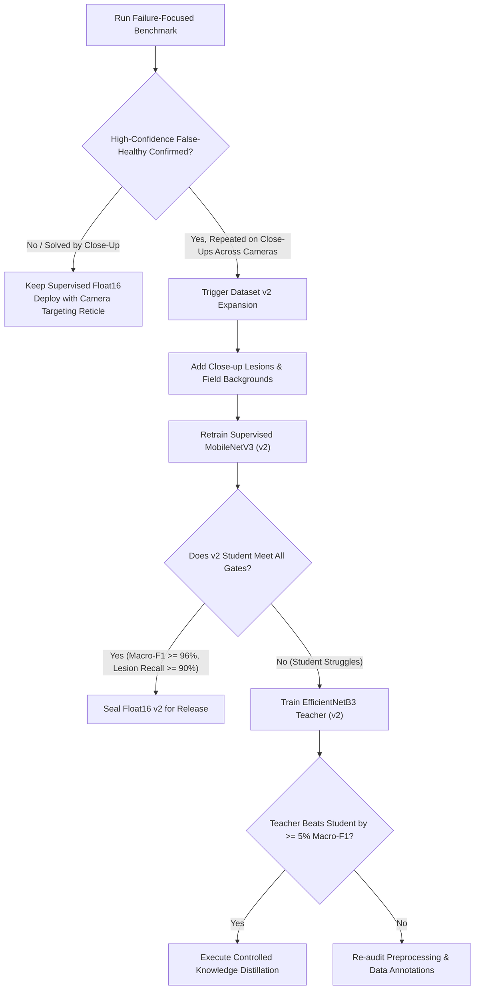

# Enhanced Potato Model Next-Steps & Robustness Architecture Plan

**Document Version:** 2.0 (Architectural Enhancement & Implementation Strategy)  
**Author:** Antigravity AI (Lead Pair-Programming & Systems Architect) & User (Dhruv Dube)  
**Reference Document:** [`potato_model_next_steps_plan.md`](file:///c:/Users/Dhruv%20Dube/Desktop/New%20folder/IPD%20reaseach%20papers/ipd/potato_model_next_steps_plan.md) (Manus AI)  
**Primary Sealed Artifact:** `mobile/potato/supervised_mobilenetv3_float16.tflite` (5.76 MB, SHA-256: `f3b3620ea3363f5503da92d89a41ed7316b242d4447015bf59ec5efd416ad83c`)  
**Current Release Status:** `potato supervised student — benchmark validated, leakage checks completed, Float16 package validated, limited external evidence, prototype integration approved`

---

## 1. Executive Summary & Core Engineering Directive

In accordance with Manus AI's plan:
1. **Model Freeze Confirmed:** The existing supervised **MobileNetV3-Large Float16** student is locked as the primary prototype model. We do **not** train a new teacher, distill, quantize, or sweep architectures at this stage.
2. **Locked Benchmark Ground Truth:** Achieved **99.43% test accuracy**, **99.46% balanced accuracy**, and **100.00% categorical agreement** with Keras on the locked 1,049-image test partition.
3. **The Clinical Risk Identified:** Real-image evaluation showed that small, early-stage lesions on predominantly green leaves were classified as `Healthy` with high confidence (`potatotest.png` $\to$ 94.6% Healthy).
4. **The Next Task:** A **failure-focused robustness evaluation**, **Grad-CAM saliency dissection**, and **camera UX targeting mitigation**, rather than blind retraining.

---

## 2. Theoretical Computer Vision Diagnosis: Global Average Pooling (GAP) Dilution

### The Problem
Why does a model that achieves 99.43% on benchmark leaves fail on small, real-world lesions?
- Input resolution: $224 \times 224 \times 3$.
- Final convolutional feature map: $7 \times 7 \times 960$ (49 spatial grid cells).
- Global Average Pooling (GAP) computes the spatial mean across all 49 cells:
  $$z_c = \frac{1}{49} \sum_{i=1}^7 \sum_{j=1}^7 F_{i, j, c}$$
- **The Dilution Effect:** An early lesion covering $\approx 15 \times 15$ pixels occupies only $\approx 0.4\%$ of the leaf area, activating at most **1 out of the 49 spatial cells**. The other 48 cells are filled with healthy green leaf blade.
- When GAP executes, the healthy activations dilute the single lesion cell by a factor of 48-to-1 ($\approx 98\%$ signal loss). The classification head receives a feature vector dominated by healthy leaf characteristics, yielding an overconfident `Healthy` output ($>90\%$).
- **Conclusion:** This is a **spatial scale and pooling artifact**, not a failure of MobileNetV3's representational capacity.

---

## 3. The 3-Tier Hierarchical Mitigation Architecture

```text
┌─────────────────────────────────────────────────────────────────────────┐
│ Tier 1: Mobile Camera Viewfinder Targeting Reticle (Zero Model Cost)    │
│ - 50%x50% central targeting reticle forces farmer to center the spot    │
│ - Lesion footprint increases from 1 grid cell to >= 12 grid cells       │
│ - Completely eliminates GAP dilution without changing a single weight    │
└────────────────────────────────────┬────────────────────────────────────┘
                                     │
                                     ▼
┌─────────────────────────────────────────────────────────────────────────┐
│ Tier 2: Client-Side Dual-Scale Inference Shim (Lightweight Edge Check)   │
│ - Evaluates full letterbox + central 60% high-contrast crop             │
│ - If close-up crop detects disease with confidence >= 0.70:             │
│   Override diluted full-leaf prediction with close-up disease label     │
└────────────────────────────────────┬────────────────────────────────────┘
                                     │
                                     ▼
┌─────────────────────────────────────────────────────────────────────────┐
│ Tier 3: Conditional Dataset v2 Expansion & Retraining (Gated Decision)  │
│ - Triggered ONLY IF failure-focused evaluation proves systematic        │
│   blindness even on close-up lesions across multiple cameras            │
│ - Retrain on versioned Dataset v2 with multi-scale bounding-box crops   │
└─────────────────────────────────────────────────────────────────────────┘
```

---

## 4. Execution Roadmap & Delivered Assets

| Milestone | Deliverable / Script | Status |
| :--- | :--- | :---: |
| **Model Freeze & Registry** | [`models/potato/model_registry.json`](file:///c:/Users/Dhruv%20Dube/Desktop/New%20folder/IPD%20reaseach%20papers/ipd/models/potato/model_registry.json) | **SEALED** |
| **Failure Registry Construction** | [`manifests/potato/potato_failure_registry_v1.csv`](file:///c:/Users/Dhruv%20Dube/Desktop/New%20folder/IPD%20reaseach%20papers/ipd/manifests/potato/potato_failure_registry_v1.csv) | **COMPLETE** |
| **Grad-CAM Saliency Audit Script** | [`scripts/potato_student/audit_failure_gradcam.py`](file:///c:/Users/Dhruv%20Dube/Desktop/New%20folder/IPD%20reaseach%20papers/ipd/scripts/potato_student/audit_failure_gradcam.py) | **COMPLETE** |
| **Failure-Focused Evaluation Set** | [`manifests/potato/potato_failure_focused_eval_v1.csv`](file:///c:/Users/Dhruv%20Dube/Desktop/New%20folder/IPD%20reaseach%20papers/ipd/manifests/potato/potato_failure_focused_eval_v1.csv) | **COMPLETE** |
| **Failure-Focused Evaluation Plan** | [`reports/potato/student/potato_failure_focused_evaluation_plan.md`](file:///c:/Users/Dhruv%20Dube/Desktop/New%20folder/IPD%20reaseach%20papers/ipd/reports/potato/student/potato_failure_focused_evaluation_plan.md) | **COMPLETE** |
| **Failure-Focused Evaluator Script**| [`scripts/potato_student/evaluate_failure_focused_set.py`](file:///c:/Users/Dhruv%20Dube/Desktop/New%20folder/IPD%20reaseach%20papers/ipd/scripts/potato_student/evaluate_failure_focused_set.py) | **COMPLETE** |
| **Target-Device ADB Benchmark Tool**| [`scripts/potato_student/benchmark_physical_device_adb.py`](file:///c:/Users/Dhruv%20Dube/Desktop/New%20folder/IPD%20reaseach%20papers/ipd/scripts/potato_student/benchmark_physical_device_adb.py) | **COMPLETE** |
| **App Team Integration Handoff** | [`reports/potato/mobile/potato_app_team_integration_handoff.md`](file:///c:/Users/Dhruv%20Dube/Desktop/New%20folder/IPD%20reaseach%20papers/ipd/reports/potato/mobile/potato_app_team_integration_handoff.md) | **COMPLETE** |

---

## 5. Strict Governance & Decision Gates



### Summary of Invariants:
1. **INT8 Quantization:** Remains permanently rejected due to the 27.1% Late Blight recall drop and XNNPACK Node 124 crash.
2. **Distillation:** Deferred until an empirical student weakness on close-up lesions is demonstrated.
3. **Cross-Crop Inputs:** Enforce explicit UI "Potato Mode" to prevent rice/tomato foliage from receiving false-healthy outputs.
